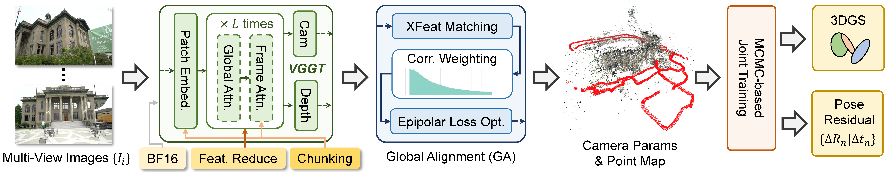

<h1 align="center"><strong>   VGGT-X: When VGGT Meets Dense Novel View Synthesis</strong></h1>
  

    <em>Institute of Automation, Chinese Academy of Sciences; University of Chinese Academy of Sciences; Linketic</em>
  

    

## 🔎 Abstract

We study the problem of applying 3D Foundation Models (3DFMs) to dense Novel View Synthesis (NVS). Despite significant progress in Novel View Synthesis powered by NeRF and 3DGS, current approaches remain reliant on accurate 3D attributes (e.g., camera poses and point clouds) acquired from Structure-from-Motion (SfM), which is often slow and fragile in low-texture or low-overlap captures. Recent 3DFMs showcase orders of magnitude speedup over the traditional pipeline and great potential for online NVS. But most of the validation and conclusions are confined to sparse-view settings. Our study reveals that naively scaling 3DFMs to dense views encounters two fundamental barriers: dramatically increasing VRAM burden and imperfect outputs that degrade initialization-sensitive 3D training. To address these barriers, we introduce **VGGT-X**, incorporating a memory-efficient VGGT implementation that scales to 1,000+ images, an adaptive global alignment for VGGT output enhancement, and robust 3DGS training practices. Extensive experiments show that these measures substantially close the fidelity gap with COLMAP-initialized pipelines, achieving state-of-the-art results in dense COLMAP-free NVS and pose estimation. Additionally, we analyze the causes of remaining gaps with COLMAP-initialized rendering, providing insights for the future development of 3D foundation models and dense NVS.

## 💡 Method

    

<b>VGGT-X</b> takes dense multi-view images as input. It first uses memory-efficient VGGT to losslessly predict 3D key attributes, which we name as VGGT--. Then, a fast global alignment module refines the predicted camera poses and point clouds. Finally, a robust joint pose and 3DGS training pipeline is applied to produce high-fidelity novel view synthesis.

## 📝 TODO List (Scheduled in October)
- [ ] Release the code for the Memory Efficient VGGT and Global Alignment.
- [ ] Release the code for Joint Pose and 3DGS Optimization.
- [ ] Release the inferred COLMAP results.

## 🤗 Citation
If you find this repository useful for your research, please use the following BibTeX entry for citation.

    @Misc{tclight,
      author = {Yang Liu, Chuanchen Luo, Zimo Tang, Junran Peng, Zhaoxiang Zhang},
      title  = {VGGT-X GitHub Page},
      year   = {2025},
    }
